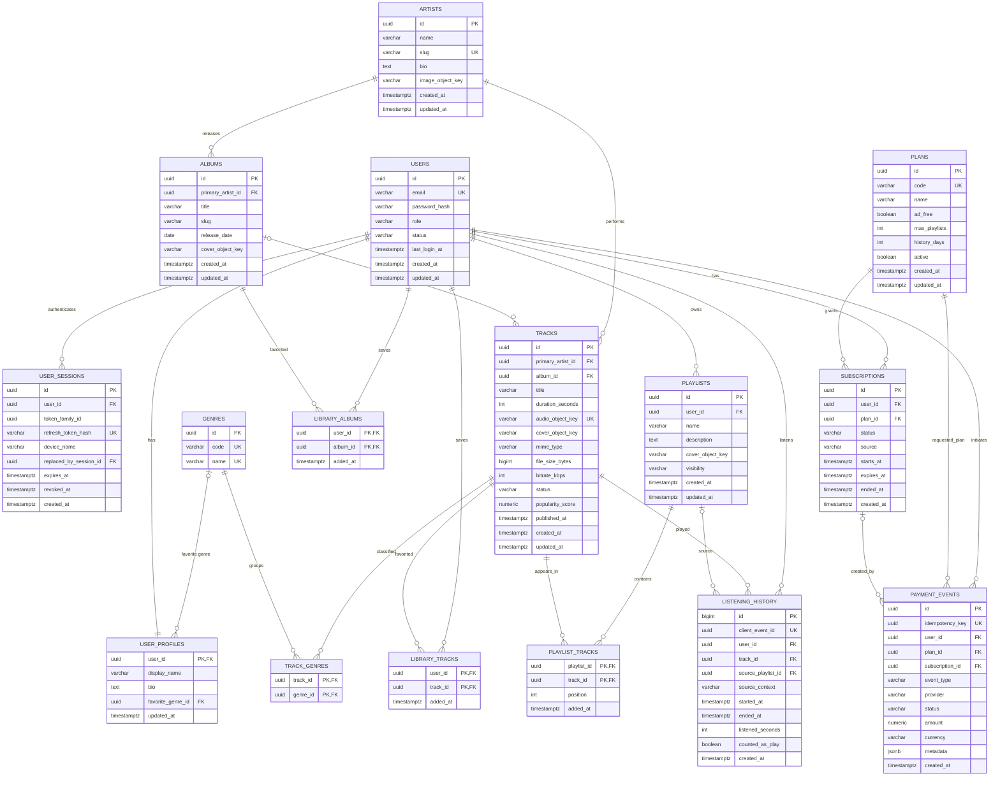

# Thiết kế database cho Online Music Player

## 1. Phạm vi

Thiết kế này dành cho ứng dụng nghe nhạc trực tuyến trên Android, backend và PostgreSQL 16 do nhóm tự triển khai. Phiên bản cốt lõi hỗ trợ:

- Đăng ký, đăng nhập và hồ sơ người dùng.
- Catalog bài hát, nghệ sĩ, album và thể loại.
- Streaming tệp âm thanh từ MinIO thông qua Spring Boot proxy.
- Tìm kiếm cơ bản theo tên bài hát, nghệ sĩ hoặc album và gợi ý bài hát liên quan bằng metadata cùng lịch sử nghe.
- Bài hát yêu thích, album yêu thích, playlist cá nhân và lịch sử nghe.
- Phân quyền Free/Premium do backend quyết định.
- Quảng cáo giới thiệu và quảng cáo âm thanh thử nghiệm giữa các bài cho Free; Premium có quyền `ad_free`.
- Thanh toán giả lập, không xử lý tiền thật và không tích hợp Google Play Billing production.

Thiết kế không bao gồm cache ứng dụng hoặc dữ liệu upload từ người dùng.

## 2. Quyết định thiết kế chính

1. **PostgreSQL 16 là nguồn dữ liệu chính.** Android chỉ gọi backend API và không kết nối trực tiếp đến database.
2. **Không lưu tệp âm thanh trong PostgreSQL.** Database chỉ lưu `audio_object_key`, `cover_object_key` và metadata. Trong MVP, các key này trỏ tới object trong MinIO; Spring Boot giữ credential MinIO và proxy nội dung về Android.
3. **Backend là nguồn quyết định gói.** Gói hiện tại được lấy từ bản ghi `subscriptions` đang hoạt động. Client không được tự gửi cờ Premium để mở quyền.
4. **Mỗi tài khoản luôn có đúng một subscription đang hoạt động.** Khi đăng ký, backend tạo subscription Free. Khi nâng cấp hoặc reset demo, backend đóng subscription cũ rồi tạo subscription mới trong cùng transaction.
5. **Lịch sử của Free bị giới hạn khi truy vấn, không xóa ngay dữ liệu cũ.** API chỉ trả về 7 ngày gần nhất cho Free; Premium có thể xem toàn bộ lịch sử.
6. **Thanh toán giả lập vẫn cần idempotency.** Một yêu cầu gửi lại không được tạo nhiều subscription Premium.
7. **Playlist không chứa trùng một bài trong phiên bản đầu.** Khóa chính ghép `(playlist_id, track_id)` giúp giảm logic và lỗi dữ liệu.
8. **Album và playlist là hai khái niệm khác nhau.** Album thuộc catalog và do hệ thống quản lý; người dùng có thể yêu thích album nhưng chỉ tự tạo playlist.

## 3. Sơ đồ ER cốt lõi



## 4. Mô tả các bảng

| Nhóm | Bảng | Mục đích | Quy tắc quan trọng |
|---|---|---|---|
| Tài khoản | `users` | Thông tin xác thực và trạng thái tài khoản | Chỉ lưu `password_hash`, không lưu mật khẩu thô |
| Tài khoản | `user_profiles` | Tên hiển thị và thông tin hồ sơ | Quan hệ một-một với `users`; không có upload avatar trong MVP |
| Tài khoản | `user_sessions` | Phiên bản refresh token theo thiết bị | Token ngẫu nhiên hạn 7 ngày; chỉ lưu hash; rotation tạo bản ghi mới cùng `token_family_id` và thu hồi bản ghi cũ |
| Catalog | `artists` | Nghệ sĩ | `slug` duy nhất để dùng trong URL hoặc tìm kiếm |
| Catalog | `albums` | Album và ảnh bìa | `primary_artist_id` bắt buộc; album có thể không có bài nếu đang chuẩn bị dữ liệu |
| Catalog | `tracks` | Metadata và vị trí tệp âm thanh | `audio_object_key` duy nhất; chỉ bài `published` mới được phát |
| Catalog | `genres` | Danh mục thể loại | Seed dữ liệu ổn định; không để client tự tạo |
| Catalog | `track_genres` | Quan hệ nhiều-nhiều giữa bài hát và thể loại | Khóa chính ghép ngăn trùng thể loại |
| Thư viện | `library_tracks` | Bài hát yêu thích | Một user chỉ lưu một track một lần |
| Thư viện | `library_albums` | Album yêu thích | Một user chỉ lưu một album một lần; không biến album thành playlist |
| Thư viện | `playlists` | Playlist thuộc người dùng | Backend kiểm tra giới hạn playlist dựa trên plan hiện tại |
| Thư viện | `playlist_tracks` | Các bài trong playlist | Không cho trùng track trong cùng playlist; `position` duy nhất trong playlist |
| Lịch sử | `listening_history` | Một phiên nghe của người dùng | `client_event_id` chống ghi trùng; `counted_as_play` chỉ đúng khi thời gian nghe thực tế đạt `min(30 giây, 50% thời lượng bài)` |
| Gói | `plans` | Quyền lợi của Free/Premium | Seed hai plan `FREE` và `PREMIUM`; không hard-code quyền ở Android |
| Gói | `subscriptions` | Lịch sử thay đổi gói của user | Mỗi user chỉ có một bản ghi `active` tại một thời điểm |
| Thanh toán | `payment_events` | Audit cho thanh toán giả lập và reset demo | `amount = 0`; `provider = mock`; `idempotency_key` duy nhất |
## 5. Giá trị seed cho Free và Premium

| Thuộc tính | Free | Premium |
|---|---:|---:|
| `code` | `FREE` | `PREMIUM` |
| `ad_free` | `false` | `true` |
| `max_playlists` | `3` | `NULL` — không giới hạn |
| `history_days` | `7` | `NULL` — toàn bộ lịch sử |

Backend nên trả về một đối tượng entitlement thống nhất, ví dụ:

```json
{
  "plan": "PREMIUM",
  "adFree": true,
  "maxPlaylists": null,
  "historyDays": null,
  "expiresAt": "2026-10-31T23:59:59Z"
}
```

Free và Premium dùng cùng thuật toán gợi ý; entitlement không chứa trường phân cấp gợi ý.

## 6. Ràng buộc database đề xuất

### Ràng buộc duy nhất

- `users.email`
- `artists.slug`
- `(albums.primary_artist_id, albums.slug)`
- `tracks.audio_object_key`
- `(track_genres.track_id, track_genres.genre_id)`
- `(library_tracks.user_id, library_tracks.track_id)`
- `(library_albums.user_id, library_albums.album_id)`
- `(playlist_tracks.playlist_id, playlist_tracks.track_id)`
- `(playlist_tracks.playlist_id, playlist_tracks.position)`
- `listening_history.client_event_id`
- `plans.code`
- `payment_events.idempotency_key`

### Check constraint

- `tracks.duration_seconds > 0`
- `tracks.file_size_bytes > 0`
- `listening_history.listened_seconds >= 0`
- `listening_history.ended_at IS NULL OR ended_at >= started_at`
- `user_sessions.expires_at > user_sessions.created_at`
- `user_sessions.replaced_by_session_id IS NULL` cho tới khi refresh token được rotation.
- `playlists.visibility IN ('private')` trong phiên bản đầu.
- `subscriptions.status IN ('active', 'expired', 'cancelled')`
- `subscriptions.expires_at IS NULL OR expires_at > starts_at`
- `payment_events.provider = 'mock'`
- `payment_events.amount = 0`

### Chỉ một subscription hoạt động

PostgreSQL nên có partial unique index:

```sql
CREATE UNIQUE INDEX uq_subscriptions_one_active_per_user
ON subscriptions (user_id)
WHERE status = 'active';
```

## 7. Index đề xuất

| Index | Mục đích |
|---|---|
| `users(lower(email))` unique | Đăng nhập không phân biệt chữ hoa/thường |
| `user_sessions(token_family_id, revoked_at)` | Tìm và thu hồi toàn bộ refresh token trong một family khi phát hiện sử dụng lại |
| `tracks(status, published_at DESC)` | Trang chủ và bài mới |
| `tracks(primary_artist_id)` | Lấy bài theo nghệ sĩ |
| `tracks(album_id, published_at)` | Lấy danh sách bài trong album |
| `track_genres(genre_id, track_id)` | Lọc bài theo thể loại và tính gợi ý |
| `library_tracks(user_id, added_at DESC)` | Thư viện gần đây |
| `library_albums(user_id, added_at DESC)` | Album yêu thích gần đây của user |
| `library_albums(album_id)` | Đếm lượt yêu thích hoặc lấy mức phổ biến của album |
| `playlists(user_id, updated_at DESC)` | Danh sách playlist của user |
| `playlist_tracks(playlist_id, position)` unique | Đọc playlist đúng thứ tự |
| `listening_history(user_id, started_at DESC)` | Lịch sử theo user |
| `listening_history(track_id, started_at DESC)` | Độ phổ biến và thống kê bài hát |
| `subscriptions(user_id, status)` | Tìm gói hiện tại |
| `payment_events(user_id, created_at DESC)` | Audit nâng cấp/reset demo |

Tìm kiếm MVP so khớp chuỗi `q` với `tracks.title`, `artists.name` và `albums.title`. Với bộ dữ liệu demo nhỏ, dùng `ILIKE`, join theo khóa ngoại và phân trang là đủ; không cần bộ lọc hoặc extension tìm kiếm riêng.

## 8. Luồng dữ liệu quan trọng

### 8.1 Đăng ký tài khoản

Trong một transaction:

1. Tạo `users` với `password_hash`.
2. Tạo `user_profiles`.
3. Tìm plan `FREE`.
4. Tạo `subscriptions` Free ở trạng thái `active`, `expires_at = NULL`.

### 8.2 Nâng cấp Premium giả lập

Trong một transaction:

1. Kiểm tra `payment_events.idempotency_key`.
2. Khóa subscription đang hoạt động của user bằng `SELECT ... FOR UPDATE`.
3. Chuyển subscription hiện tại thành `cancelled` hoặc `expired`.
4. Tạo subscription Premium có thời hạn demo.
5. Tạo `payment_events` với `provider = mock`, `amount = 0`, `status = success`.
6. Trả entitlement mới về Android.

### 8.3 Reset tài khoản về Free để demo lại

1. Đóng subscription Premium đang hoạt động.
2. Tạo subscription Free mới.
3. Tạo `payment_events.event_type = mock_reset`.

### 8.4 Ghi nhận lịch sử nghe

1. Android tạo một `client_event_id` cho phiên nghe.
2. Backend xác thực user và track.
3. Backend tính ngưỡng `LEAST(30, CEIL(tracks.duration_seconds * 0.5))` và chỉ đặt `counted_as_play = true` khi `listened_seconds` đạt ngưỡng. `listened_seconds` là thời gian phát thực tế tích lũy, không lấy trực tiếp từ vị trí phát nên thao tác tua không làm tăng lượt.
4. Insert `listening_history`; nếu `client_event_id` đã tồn tại thì trả lại bản ghi cũ.
5. Một lần nghe lại từ đầu dùng `client_event_id` mới và chỉ tạo lượt mới sau khi đạt ngưỡng.

### 8.5 Gợi ý bài hát liên quan

Phiên bản đầu không cần bảng recommendation riêng. Backend tính điểm ứng viên đã chuẩn hóa về khoảng `0..1`:

`score = 0.45 * genre_affinity + 0.30 * artist_affinity + 0.15 * popularity + 0.10 * recency`

- `genre_affinity` lấy từ thể loại của bài đang phát, các lượt nghe có `counted_as_play = true` và bài đã yêu thích.
- `artist_affinity` lấy từ tần suất nghe hợp lệ và bài đã yêu thích theo nghệ sĩ.
- `popularity` được chuẩn hóa từ số lượt nghe hợp lệ toàn hệ thống; `recency` dựa trên `published_at`.
- Loại bài đang phát và 20 bài vừa nghe trước khi sắp xếp kết quả.
- Free và Premium dùng cùng công thức; không có trường phân cấp gợi ý theo gói.
- Tài khoản có dưới 5 bản ghi `counted_as_play = true` dùng cold start: 60% ứng viên theo `popularity_score`, 40% theo `published_at DESC`, tối đa 2 bài mỗi nghệ sĩ.
- Dữ liệu demo seed khoảng 50 track hợp pháp, 10 nghệ sĩ, 10 album và 5 thể loại; mỗi track có `popularity_score` ban đầu để cold start hoạt động trước khi có đủ lịch sử thật.

### 8.6 Lưu nội dung vào Thư viện của tôi

- Từ màn hình Now Playing, nhấn tim bài hát gọi API yêu thích và dùng `INSERT ... ON CONFLICT DO NOTHING` vào `library_tracks`; bài hát tự xuất hiện trong **Bài hát yêu thích**.
- Từ chi tiết album trong luồng nghe nhạc, nhấn tim album gọi API yêu thích và dùng `INSERT ... ON CONFLICT DO NOTHING` vào `library_albums`; album tự xuất hiện trong **Album yêu thích**.
- Tạo playlist ghi vào `playlists`; từ Player, thêm bài vào playlist ghi vào `playlist_tracks` sau khi backend kiểm tra playlist thuộc về user hiện tại.
- Nếu hỗ trợ bỏ tim, backend xóa đúng cặp `(user_id, track_id)` hoặc `(user_id, album_id)` tương ứng.
- Các thao tác yêu thích phải idempotent để việc retry từ mobile không tạo dữ liệu trùng.

## 9. Chính sách xóa dữ liệu

- Xóa `users`: nên ưu tiên đổi `status = deleted` trong bản demo để tránh mất lịch sử ngoài ý muốn.
- Xóa playlist: cascade `playlist_tracks`.
- Xóa track đã có lịch sử: dùng `status = archived`, không xóa vật lý.
- Xóa album: ưu tiên archive; nếu buộc xóa vật lý thì cascade `library_albums` và đặt `tracks.album_id = NULL` nếu vẫn giữ track.
- Thu hồi session: cập nhật `user_sessions.revoked_at`, không xóa ngay để phát hiện token cũ bị sử dụng lại. Rotation tạo bản ghi mới cùng `token_family_id` và liên kết qua `replaced_by_session_id`; nếu token đã thu hồi bị dùng lại thì thu hồi toàn bộ family của thiết bị đó.
- Chỉ xóa object trong MinIO sau khi chắc chắn không còn bản ghi metadata tham chiếu.

## 10. Thứ tự migration đề xuất

Spring Boot chạy Flyway khi khởi động. Mỗi thay đổi schema là một file SQL bất biến theo quy ước `V{version}__{description}.sql`; không sửa migration đã chạy trên môi trường dùng chung mà tạo migration mới.

1. `users`, `genres`, `plans`.
2. `user_profiles`, `user_sessions`.
3. `artists`, `albums`, `tracks`, `track_genres`.
4. `library_tracks`, `library_albums`, `playlists`, `playlist_tracks`.
5. `listening_history`.
6. `subscriptions`, `payment_events`.
7. Seed `FREE`, `PREMIUM`, khoảng 5 thể loại, 10 nghệ sĩ, 10 album và 50 track hợp pháp kèm `popularity_score` ban đầu.

### Sao lưu và khôi phục MVP

- Trước buổi chạy thử và demo, chạy `pg_dump` rồi lưu file backup trên ổ đĩa khác hoặc máy của một thành viên.
- Sao chép thư mục dữ liệu MinIO tới cùng đích backup; backup phải giữ cả object lẫn metadata PostgreSQL tương ứng.
- Trước buổi demo cuối, khôi phục thử database vào một database tạm và mở thử ít nhất một tệp audio từ bản sao MinIO.
- Migration Flyway vẫn là nguồn tạo schema; backup dùng để khôi phục dữ liệu, không thay thế migration.

## 11. Những phần cố ý chưa đưa vào

- Video âm nhạc.
- Thanh toán thật và thông tin thẻ.
- Google Play Billing production.
- Quảng cáo production và bảng doanh thu quảng cáo.
- Bình luận, follow nghệ sĩ hoặc mạng xã hội.
- Tải nhạc ngoại tuyến và DRM.
- Phân tích AI trực tiếp file âm thanh.
- Upload ảnh đại diện hoặc nội dung từ người dùng.
- Cache dữ liệu ứng dụng.
- Phân cấp recommendation theo gói.
- Hiệu ứng animation tùy chỉnh.
- Partitioning hoặc kiến trúc dữ liệu cho quy mô thương mại.

Thiết kế này ưu tiên một luồng demo ổn định, dễ chia việc cho nhóm 7 người và có thể hoàn thành phần cốt lõi trong hai tuần đầu.
