# Kiến trúc hệ thống và các luồng chính cho Online Music Player

**Trạng thái:** Kiến trúc MVP đã được chốt cho giai đoạn triển khai  
**Phạm vi:** Ứng dụng Android, backend tự quản lý, PostgreSQL và MinIO  
**Cơ sở:** `online-music-player-project-brief.md` và `database-design.md`  
**Đối tượng đọc:** Nhóm phát triển, người review đồ án và thành viên mới

## 1. Mục tiêu của tài liệu

Tài liệu này đề xuất một cấu trúc đủ rõ để nhóm 7 người có thể phát triển song song trong 3 tuần mà vẫn giữ được một luồng demo xuyên suốt. Kiến trúc ưu tiên:

- Hoàn thành và kiểm thử được luồng đăng nhập → tìm/chọn bài → phát nhạc → ghi nhận lịch sử.
- Tách giao diện, nghiệp vụ và hạ tầng để thay đổi framework hoặc thư viện không làm lan truyền lỗi.
- Giữ backend đơn giản để triển khai: một ứng dụng backend dạng modular monolith, không tách microservice trong phiên bản đồ án.
- Để backend quyết định mọi quyền lợi Free/Premium; client chỉ hiển thị trạng thái nhận từ server.
- Không để từng màn hình sở hữu trực tiếp audio engine hoặc queue của phiên phát nhạc.
- Giữ tìm kiếm ở mức nhập tên bài hát, nghệ sĩ hoặc album và loại bỏ bộ lọc nâng cao để bảo đảm hoàn thành trong 3 tuần.

## 2. Giả định và quyết định nền tảng

Repository hiện chưa có mã nguồn. Framework mobile đã chốt là Kotlin Native phát triển bằng Android Studio; backend đã chốt Java với Spring Boot. Cấu trúc bên dưới vì vậy cụ thể cho Android và Spring Boot nhưng vẫn giữ các ranh giới nghiệp vụ độc lập với UI framework.

| Nội dung | Lựa chọn | Trạng thái |
|---|---|---|
| Mobile | Kotlin Native trên Android; feature-first, một chiều dữ liệu | Đã chốt: phát triển bằng Android Studio |
| Android UI | XML Views với Activity/Fragment | Đã chốt; không dùng Jetpack Compose trong MVP |
| Backend | Java + Spring Boot; modular monolith, REST/JSON | Đã chốt |
| Database | PostgreSQL 16 + Flyway | Đã chốt |
| Audio storage | MinIO chạy trực tiếp trên server | Đã chốt cho MVP |
| Streaming | Spring Boot proxy, hỗ trợ HTTP Range và trả `206 Partial Content` | Đã chốt; signed URL để sau |
| Authentication | JWT HS256 15 phút + opaque refresh token 7 ngày | Đã chốt; lưu hash, rotation mỗi lần refresh và thu hồi khi logout/đổi mật khẩu |
| Local data | Android Keystore + Preferences DataStore | Đã chốt; access token trong RAM, refresh token được mã hóa, không dùng Room hoặc cache metadata |
| State management | AndroidX ViewModel + StateFlow | Đã chốt; XML Views collect bằng `repeatOnLifecycle` |
| Dependency injection | Hilt | Đã chốt; dùng cho Activity, Fragment, ViewModel, Service và các dependency dùng chung |
| Playback | AndroidX Media3 ExoPlayer trong `MediaSessionService` | Đã chốt; hỗ trợ foreground service và phát nền |
| Recommendation | Content-based có trọng số từ metadata và lịch sử | Đã chốt; cold start dưới 5 lượt hợp lệ, seed 50 track |
| Triển khai MVP | Một máy Windows của nhóm | Đã chốt; Spring Boot, PostgreSQL và MinIO khởi động riêng |

Trong MVP, ExoPlayer và `MediaSession` nằm trong foreground `MediaSessionService` để tiếp tục phát khi người dùng chuyển ứng dụng hoặc khóa màn hình. Android UI kết nối qua `MediaController`; hệ thống cung cấp media notification và chuyển lệnh từ màn hình khóa hoặc tai nghe tới session.

## 3. Kiến trúc tổng quan

### 3.1. Lựa chọn kiến trúc

- **Mobile:** feature-first kết hợp ranh giới Presentation → Application → Domain; Data và Platform là adapter hướng vào các contract ổn định.
- **Backend:** modular monolith. Mỗi module nghiệp vụ có controller, use case, domain rule và repository riêng nhưng cùng chạy trong một tiến trình triển khai.
- **Dữ liệu:** PostgreSQL lưu metadata và trạng thái nghiệp vụ; MinIO lưu tệp âm thanh và ảnh.
- **Giao tiếp:** mobile chỉ dùng API của backend. Spring Boot truy cập database và MinIO, sau đó proxy byte range về ứng dụng.

Lựa chọn modular monolith phù hợp hơn microservices vì nhóm chỉ có 3 tuần, một sản phẩm, một database chính và một quy trình triển khai. Module vẫn cần tách rõ để có thể tách dịch vụ sau này nếu sản phẩm tiếp tục phát triển.

### 3.2. C4 System Context

Câu hỏi của sơ đồ: Ai sử dụng hệ thống và hệ thống mang lại kết quả gì?

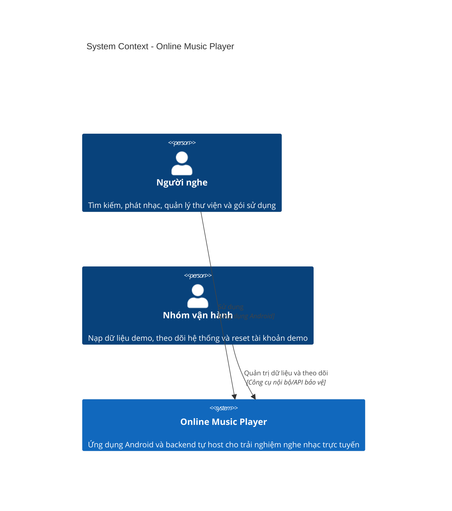

### 3.3. C4 Container

Câu hỏi của sơ đồ: Những đơn vị có thể chạy hoặc lưu trữ độc lập nào tạo thành hệ thống?

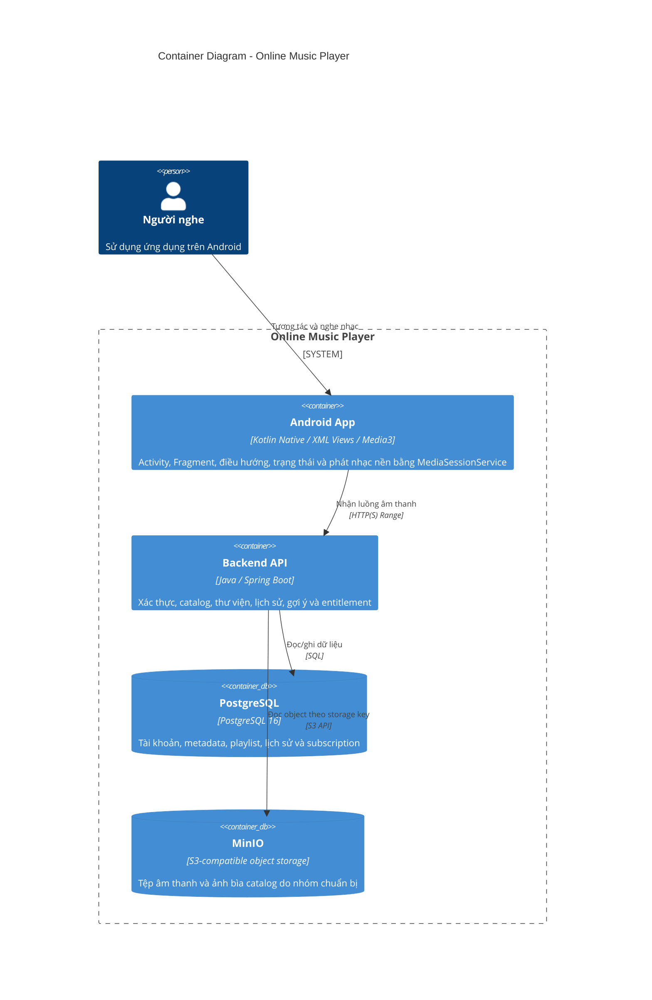

Không biểu diễn state manager, HTTP client hay thư viện dùng chung như các container vì chúng không phải đơn vị triển khai độc lập.

### 3.4. C4 Deployment cho MVP

Câu hỏi của sơ đồ: Các container được đặt ở đâu và được vận hành như thế nào trong bản demo?

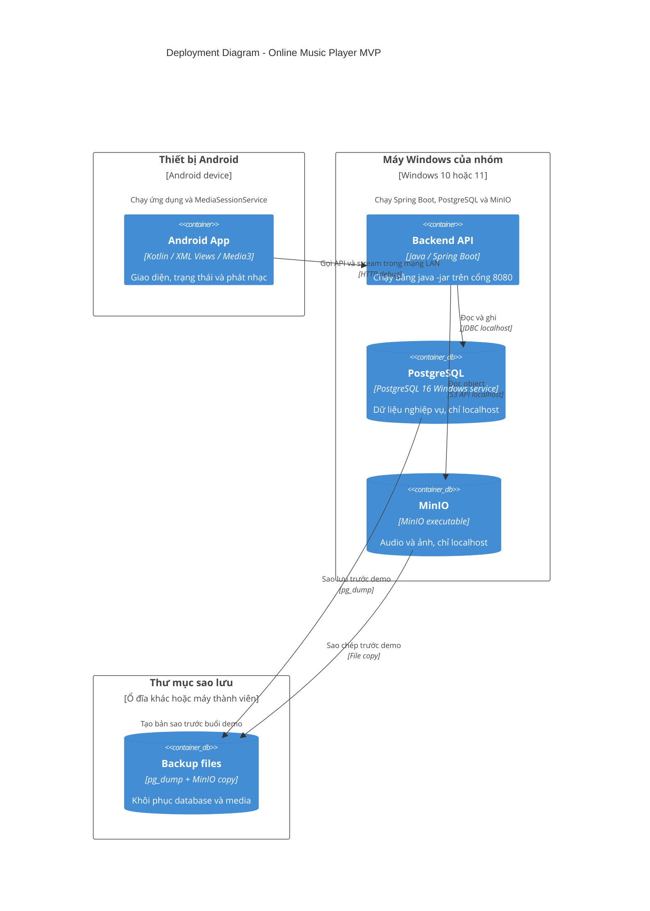

Windows Firewall chỉ mở cổng Spring Boot `8080` trong mạng riêng để điện thoại kiểm thử truy cập. PostgreSQL và MinIO bind vào localhost. Android chỉ cho phép HTTP LAN trong debug build; nếu đưa hệ thống ra Internet hoặc phát hành thật thì phải bổ sung HTTPS.

## 4. Cấu trúc ứng dụng mobile

### 4.1. Cấu trúc thư mục đề xuất

```text
mobile/
├── app/                         # Bootstrap Hilt, navigation và app lifecycle
├── core/
│   ├── config/                  # Biến môi trường và build configuration
│   ├── network/                 # HTTP client, auth interceptor, DTO lỗi chuẩn
│   ├── storage/                 # Secure storage và Preferences DataStore
│   ├── playback/                # ExoPlayer, MediaSessionService, MediaController và queue
│   ├── design_system/           # Theme và UI component dùng chung
│   └── testing/                 # Fake, fixture và test helper
├── features/
│   ├── auth/
│   ├── home/
│   ├── search/
│   ├── player/
│   ├── library/
│   ├── playlists/
│   ├── history/
│   ├── profile/
│   └── subscription/
└── shared/
    ├── models/                  # Kiểu thật sự dùng chung, giữ ở mức tối thiểu
    └── utilities/               # Hàm thuần dùng chung, không chứa nghiệp vụ
```

Mỗi feature chỉ tạo đủ các lớp mà feature đó cần:

```text
feature/
├── presentation/                # Screen, component, view state và event
├── application/                 # Use case/controller điều phối luồng
├── domain/                      # Entity, value object, rule và repository contract
└── data/                        # API DTO, mapper và repository implementation
```

Không bắt buộc tạo bốn thư mục rỗng cho feature rất nhỏ. Mục tiêu là giữ ranh giới, không phải tăng số lượng file.

### 4.2. Quy tắc dependency trên mobile

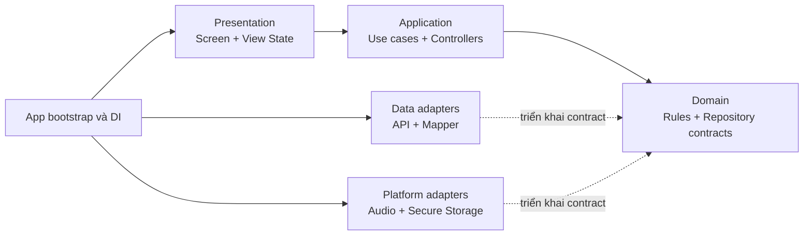

Các quy tắc bắt buộc:

1. Screen không gọi HTTP client hoặc nguồn lưu trữ trực tiếp.
2. DTO của API không đi thẳng vào UI; chuyển sang model phù hợp trước khi hiển thị.
3. Domain không import framework UI, HTTP client hay SDK audio.
4. Playback session thuộc `core/playback`, không thuộc vòng đời của màn hình Player.
5. Mini player và màn hình Now Playing quan sát cùng một `PlaybackState` duy nhất.
6. Token phải nằm trong secure storage; không ghi access token hoặc refresh token vào log.
7. Mỗi trạng thái bất đồng bộ phải biểu diễn được loading, success, empty và error.

### 4.3. Trạng thái player tối thiểu

Player nên có state machine riêng thay vì nhiều cờ boolean độc lập:

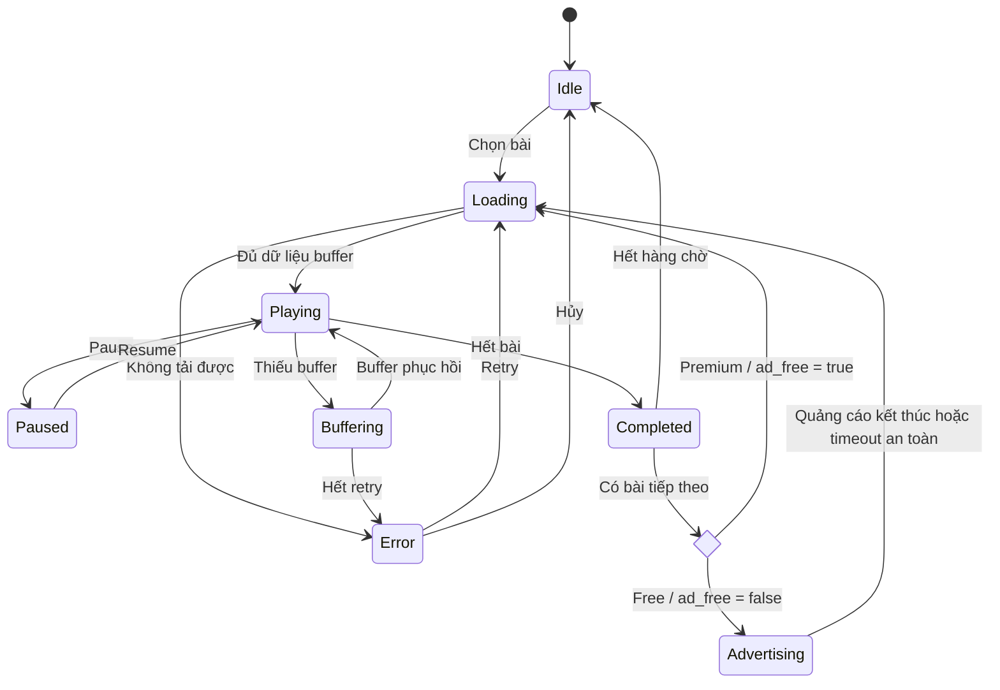

## 5. Cấu trúc backend

### 5.1. Modular monolith theo nghiệp vụ

```text
backend/
├── bootstrap/                   # Khởi tạo server, DI và route registration
├── modules/
│   ├── auth/                    # Đăng ký, đăng nhập, refresh, revoke session
│   ├── profiles/                # Hồ sơ và thống kê cơ bản
│   ├── catalog/                 # Track, artist, album, genre
│   ├── search/                  # Tìm kiếm theo tên bài hát, nghệ sĩ hoặc album
│   ├── playback/                # Metadata phát và HTTP Range streaming
│   ├── library/                 # Favorite tracks
│   ├── playlists/               # Playlist và giới hạn theo gói
│   ├── history/                 # Listening event và lịch sử
│   ├── recommendations/         # Content-based ranking và cold start
│   └── subscriptions/           # Plan, entitlement và payment demo
├── shared/
│   ├── database/                # Connection, transaction và migration
│   ├── object_storage/          # MinIO S3 adapter
│   ├── http/                    # Error envelope, middleware, pagination
│   ├── security/                # Token, password hash và authorization
│   └── config/                  # Cấu hình và secret từ môi trường
└── tests/
    ├── unit/
    ├── integration/
    └── contract/
```

### 5.2. Ranh giới module

- Module không truy cập bảng của module khác bằng câu SQL rải rác. Giao tiếp qua service/use case công khai hoặc query được định nghĩa rõ.
- `subscriptions` là nguồn quyết định entitlement: `ad_free`, `max_playlists` và `history_days`.
- `playlists` phải hỏi entitlement trước khi tạo playlist mới; không tin số lượng hoặc gói do client gửi lên.
- `history` nhận `client_event_id` để việc gửi lại không tạo lượt nghe trùng.
- `playback` chỉ phát các track có trạng thái cho phép và phải hỗ trợ header `Range`.
- `recommendations` đọc dữ liệu catalog/history nhưng không được làm chậm endpoint phát nhạc.

## 6. User flow

Các sơ đồ trong mục này chỉ thể hiện thao tác của người dùng và phản hồi nhìn thấy trên frontend. Chi tiết API, database và storage nằm trong System Flow.

Quy ước ký pháp được dùng thống nhất trong sơ đồ:

| Hình | Mermaid | Ý nghĩa |
|---|---|---|
| Oval/bo tròn | `([Bắt đầu hoặc kết thúc])` | Điểm bắt đầu hoặc kết thúc luồng |
| Hình chữ nhật | `[Chức năng hoặc màn hình]` | Một hành động xử lý, chức năng hoặc màn hình |
| Hình bình hành | `[/Dữ liệu vào hoặc ra/]` | Người dùng nhập dữ liệu hoặc hệ thống xuất dữ liệu |
| Hình thoi | `{Điều kiện?}` | Điểm quyết định; mỗi nhánh ra phải có nhãn rõ ràng |
| Mũi tên | `A --> B` | Thứ tự di chuyển giữa các bước |


### 6.1. Vào Home và điều hướng giữa bốn mục chính

Câu hỏi của sơ đồ: Sau khi mở ứng dụng, người dùng vào Home mặc định rồi chuyển sang Search, Thư viện hoặc Profile bằng cách nào?

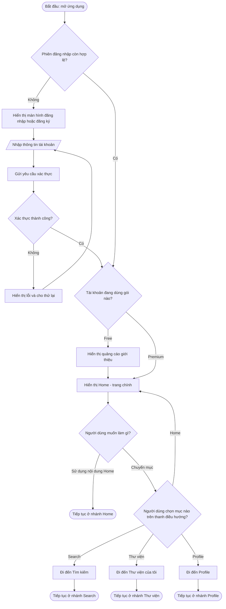

### 6.2. Nhánh Home và Search

Câu hỏi của sơ đồ: Từ Home là trang chính, người dùng xem nội dung hoặc chuyển sang Search để chọn bài như thế nào?

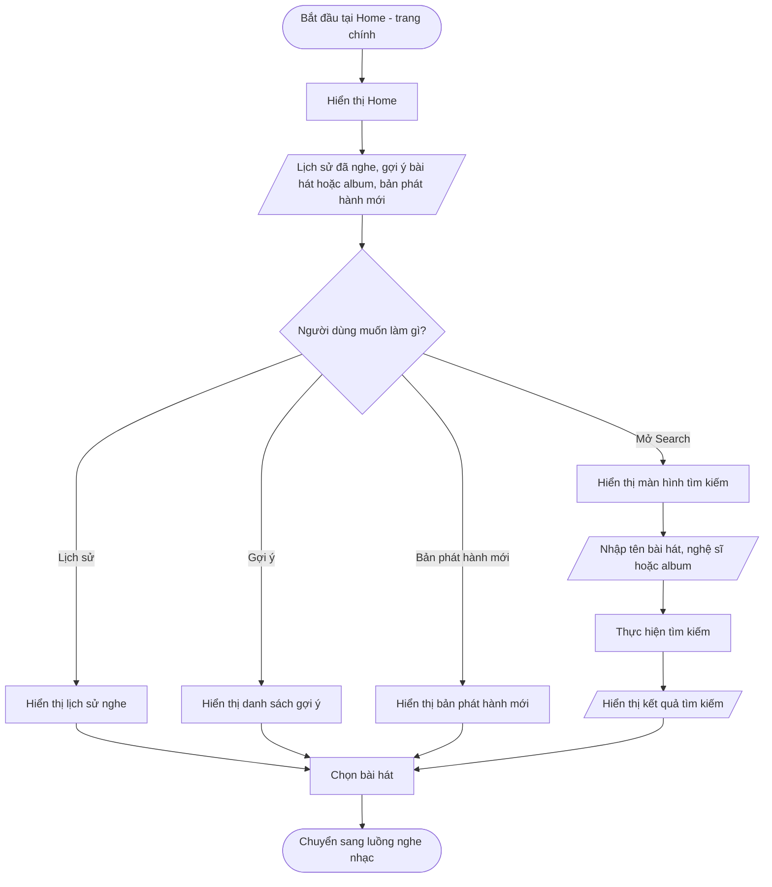

### 6.3. Thư viện của tôi

Câu hỏi của sơ đồ: Người dùng xem bài hát yêu thích, album yêu thích và quản lý playlist cá nhân như thế nào?

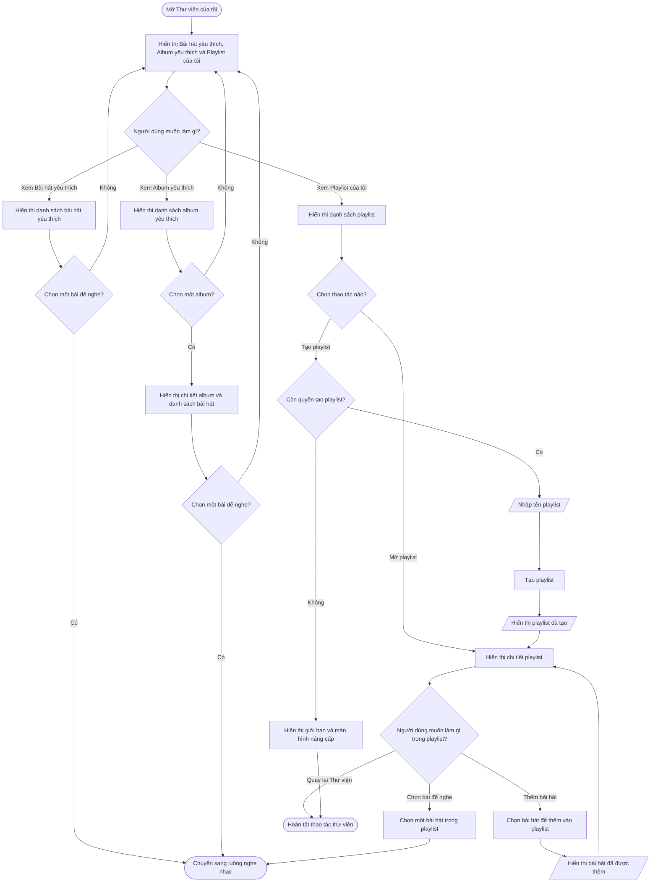

Trong giao diện, tên đúng của mục này là **Thư viện của tôi**, gồm ba nhóm độc lập: **Bài hát yêu thích**, **Album yêu thích** và **Playlist của tôi**. Sau khi tạo playlist, ứng dụng mở ngay chi tiết playlist; người dùng có thể thêm bài hát hoặc chọn một bài đã có để chuyển sang luồng nghe nhạc. Luồng này dùng để xem nội dung đã lưu, mở nội dung để nghe và quản lý playlist; thao tác thêm yêu thích nằm trong luồng nghe nhạc. Người dùng chỉ tạo **playlist**; **album** là bản phát hành thuộc catalog do hệ thống quản lý.

### 6.4. Nghe nhạc và quảng cáo theo gói

Câu hỏi của sơ đồ: Từ trang nghe nhạc, người dùng chuyển bài, yêu thích nội dung, xem thông tin và tiếp tục điều khiển khi ứng dụng chạy nền như thế nào?

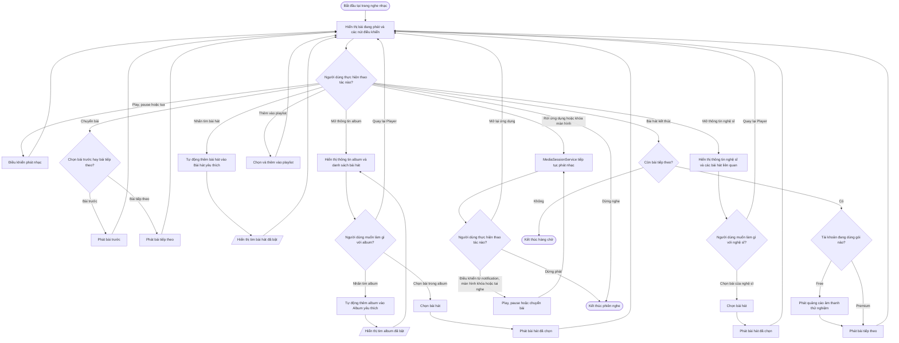

Luồng này bắt đầu khi người dùng đã ở trang nghe nhạc. “Tác giả” trong giao diện âm nhạc được chuẩn hóa thành **nghệ sĩ** để thống nhất với catalog và bảng `artists`. Khi người dùng rời ứng dụng hoặc khóa màn hình, `MediaSessionService` tiếp tục sở hữu player và queue; UI kết nối lại qua `MediaController` khi mở ứng dụng. Khi người dùng nhấn tim bài hát hoặc album, ứng dụng gửi yêu cầu lưu ngay và nội dung tự xuất hiện trong đúng nhóm của **Thư viện của tôi**. Quảng cáo âm thanh chỉ bắt đầu sau khi bài hiện tại đã kết thúc và không được chen ngang bài đang phát.

### 6.5. Profile và nâng cấp Premium

Câu hỏi của sơ đồ: Người dùng xem gói hiện tại và nâng cấp từ Free lên Premium như thế nào?

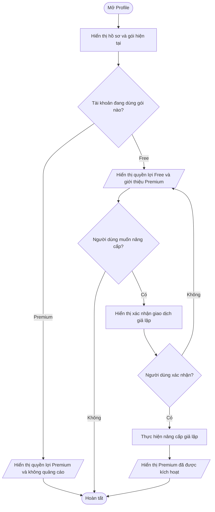

Luồng chỉnh sửa hồ sơ và reset tài khoản demo nên được vẽ riêng nếu cần triển khai chi tiết; chúng không nằm trên kịch bản nghe nhạc chính.

## 7. System flow

### 7.1. Đăng nhập và khôi phục phiên

Câu hỏi của sơ đồ: Token được cấp, lưu và làm mới như thế nào?

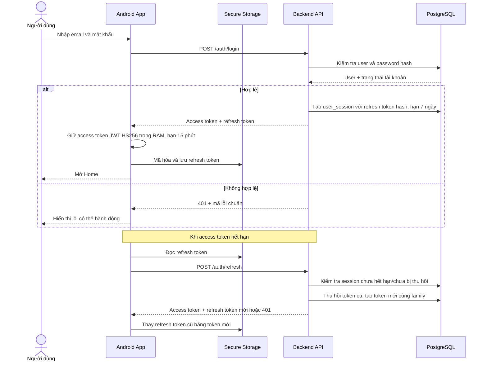

### 7.2. Phát nhạc và ghi nhận lịch sử

Câu hỏi của sơ đồ: Một thao tác Play đi qua mobile, backend, storage và history như thế nào?

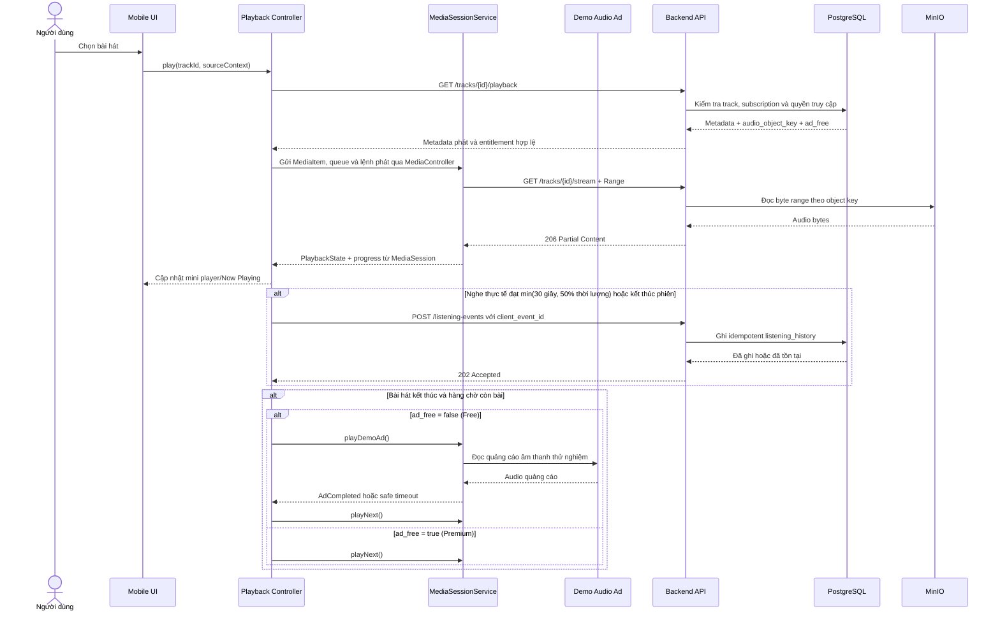

`MediaSessionService` sở hữu ExoPlayer, MediaSession và queue; Activity/Fragment chỉ gửi lệnh qua `MediaController`. Nếu mạng gián đoạn, service được retry có giới hạn. Khi người dùng gạt ứng dụng khỏi recent tasks, service vẫn tiếp tục nếu playback đang hoạt động; Force stop sẽ dừng service. Chỉ ghi `counted_as_play = true` khi thời gian nghe thực tế tích lũy đạt `min(30 giây, 50% thời lượng bài)`; thời gian tua nhảy không được cộng và mỗi `client_event_id` chỉ được tính một lần. Quảng cáo demo không được chặn hàng chờ vô thời hạn.

### 7.3. Nâng cấp Premium giả lập

Câu hỏi của sơ đồ: Backend làm thế nào để giao dịch demo chỉ tạo một subscription hợp lệ?

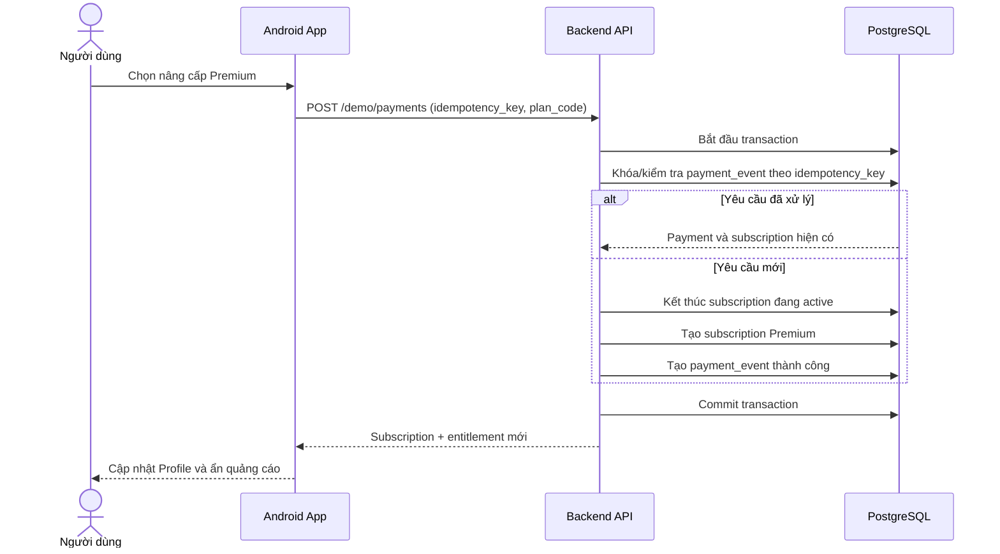

Endpoint demo phải bị tắt hoặc được bảo vệ nếu hệ thống được sử dụng ngoài môi trường đồ án.

### 7.4. Gợi ý bài hát

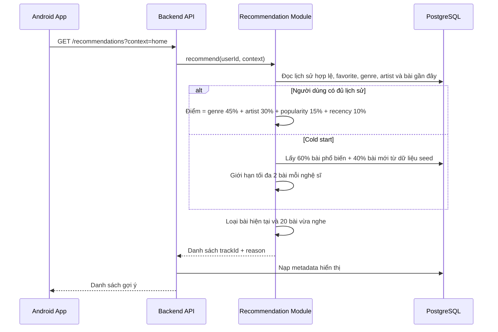

## 8. API boundary tối thiểu

| Nhóm | Endpoint gợi ý | Trách nhiệm |
|---|---|---|
| Auth | `POST /auth/register`, `POST /auth/login`, `POST /auth/refresh`, `POST /auth/logout` | Phiên đăng nhập và token |
| Home/catalog | `GET /home`, `GET /tracks/{id}`, `GET /albums/{id}`, `GET /artists/{id}` | Metadata bài hát, album và nghệ sĩ cho màn hình khám phá và Player |
| Search | `GET /search?q=` | Tìm bài hát, nghệ sĩ và album theo tên, có phân trang; không có tham số lọc |
| Playback | `GET /tracks/{id}/playback`, `GET /tracks/{id}/stream` | Trả metadata, entitlement và hỗ trợ HTTP Range |
| History | `POST /listening-events`, `GET /me/history` | Ghi idempotent và giới hạn theo gói |
| Library | `GET/PUT/DELETE /me/library/tracks/{id}`, `GET/PUT/DELETE /me/library/albums/{id}` | Bài hát yêu thích và album yêu thích |
| Playlists | `GET/POST /me/playlists`, `PUT/DELETE /me/playlists/{id}`, `POST/DELETE /me/playlists/{id}/tracks/{trackId}` | Quản lý playlist, quota và các bài hát trong playlist |
| Profile | `GET/PATCH /me/profile`, `GET /me/stats` | Hồ sơ và thống kê |
| Subscription | `GET /me/entitlements`, `POST /demo/payments`, `POST /demo/reset-plan` | Quyền lợi và demo Premium |
| Recommendation | `GET /recommendations` | Danh sách track kèm lý do đơn giản |

Mọi response lỗi nên có cùng envelope, ví dụ `code`, `message`, `details`, `request_id`. Client phân loại tối thiểu: lỗi người dùng có thể sửa, lỗi có thể retry, lỗi hết phiên và lỗi hệ thống.

## 9. Dữ liệu và đồng bộ

- PostgreSQL là nguồn sự thật cho tài khoản, catalog, bài hát yêu thích, album yêu thích, playlist, lịch sử và subscription.
- Mobile không cache metadata trong MVP; dữ liệu màn hình được lấy lại từ API khi cần. Queue chỉ tồn tại trong `MediaSessionService` của phiên chạy hiện tại.
- Audio không lưu trong database và không hỗ trợ tải offline trong phạm vi đồ án.
- `audio_object_key` không được trả như đường dẫn filesystem nội bộ.
- Mọi listening event có `client_event_id`; backend xử lý idempotent.
- Việc nâng cấp/reset plan phải đóng subscription cũ và tạo subscription mới trong cùng transaction.
- Lịch sử Free được giới hạn ở tầng query; không xóa dữ liệu cũ chỉ vì người dùng đang dùng Free.

## 10. Bảo mật và khả năng phục hồi

- Hash mật khẩu bằng thuật toán phù hợp như Argon2id hoặc bcrypt; không mã hóa hai chiều mật khẩu.
- Chỉ lưu hash của refresh token trong database.
- Access token là JWT ký bằng HS256, có thời hạn 15 phút; khóa ký chỉ nằm trong cấu hình bí mật của backend và không được commit vào repository.
- Refresh token là chuỗi ngẫu nhiên không mang dữ liệu nghiệp vụ, có thời hạn 7 ngày và được rotation sau mỗi lần sử dụng. Backend giữ bản ghi token cũ ở trạng thái thu hồi để phát hiện sử dụng lại và thu hồi cả token family.
- Thu hồi refresh token khi người dùng đăng xuất hoặc đổi mật khẩu.
- Kiểm tra quyền ở backend cho mọi thao tác Premium và quota playlist.
- Validate ID, phân trang, MIME type và Range header tại ranh giới HTTP.
- Giới hạn kích thước request và rate-limit các endpoint auth, search và payment demo.
- Gắn `request_id` cho mỗi request để nối log mobile/backend khi demo lỗi.
- Retry chỉ áp dụng cho lỗi mạng tạm thời và phải có giới hạn/backoff; không retry vô hạn.
- Không retry tự động thao tác ghi nếu chưa có idempotency key.
- Có dữ liệu demo cục bộ và kịch bản dự phòng nếu hạ tầng self-host mất mạng.

### 10.1. Vận hành MVP

- Một thành viên chạy PostgreSQL 16, MinIO và file JAR Spring Boot trực tiếp trên máy Windows.
- Nhóm có thể tạo một script PowerShell đơn giản để khởi động và kiểm tra ba tiến trình, nhưng vẫn có thể chạy từng lệnh thủ công khi mới học.
- Dùng Spring Boot Actuator `/actuator/health` để kiểm tra bằng trình duyệt.
- Spring Boot ghi log ra console và một file rolling đơn giản. Log có `request_id` nhưng không chứa token, mật khẩu hay dữ liệu riêng tư.
- Trước mỗi buổi demo, kiểm tra health endpoint, dung lượng đĩa, phát thử một bài và tua bằng HTTP Range trên điện thoại thật.

### 10.2. Sao lưu và khôi phục

- Trước buổi chạy thử và buổi demo, chạy `pg_dump` và sao chép thư mục dữ liệu MinIO sang ổ đĩa khác hoặc máy của một thành viên.
- Giữ ít nhất một bản backup đã kiểm tra; không coi bản sao trên cùng ổ đĩa là backup duy nhất.
- Khôi phục thử database và mở thử một tệp âm thanh từ backup trước buổi demo cuối.

## 11. Kiểm thử theo ranh giới

| Cấp | Nội dung ưu tiên |
|---|---|
| Unit | Quy tắc tính lượt nghe, entitlement, quota playlist, ranking recommendation và player state machine |
| Mobile integration | Repository ↔ API mapping, refresh token, queue và đồng bộ mini player/Now Playing |
| Backend integration | PostgreSQL transaction, idempotency, HTTP Range và MinIO adapter |
| Contract | Request/response cho auth, playback, history và subscription |
| UI/E2E | Đăng nhập → tìm bài → phát → yêu thích; Free → Premium; lỗi mạng khi đang phát |
| Device | Phát nền, khóa màn hình, media notification, nút tai nghe, tua, chuyển bài, hàng chờ và chuyển mạng trên ít nhất hai thiết bị |

## 12. Chia việc gợi ý cho 7 thành viên

| Vai trò chính | Phạm vi |
|---|---|
| 1. Mobile foundation | Bootstrap, navigation, design system, network và auth session |
| 2. Mobile playback | ExoPlayer, MediaSessionService, MediaController, queue, notification, mini player và Now Playing |
| 3. Mobile discovery | Home, search, catalog và recommendation UI |
| 4. Mobile library | Favorite, playlist, history, profile và paywall UI |
| 5. Backend identity | Auth, profile, session, middleware và error contract |
| 6. Backend media | Catalog, search, streaming Range, storage và recommendation |
| 7. Backend data/QA | Migration, subscription, payment demo, seed, deploy và integration test |

Mỗi phạm vi vẫn cần ít nhất một người review chéo. API contract phải được chốt sớm để mobile có thể dùng mock server trong khi backend đang hoàn thiện.

## 13. Thứ tự triển khai giảm rủi ro

1. Chốt stack, API error contract và cách quản lý token.
2. Dựng database migration, seed một tài khoản và một track hợp pháp.
3. Chạy được đăng nhập và phát một track bằng HTTP Range trên thiết bị thật.
4. Ổn định playback state, queue, foreground MediaSessionService, media notification và ghi listening event idempotent.
5. Hoàn thiện Home, Search, Library, Playlist và History.
6. Thêm recommendation content-based và cold start.
7. Thêm Profile, entitlement, quảng cáo placeholder và nâng cấp Premium giả lập.
8. Kiểm thử xuyên suốt, triển khai server và chuẩn bị dữ liệu/kịch bản demo.

## 14. Điều kiện chấp nhận kiến trúc

- Mobile không truy cập PostgreSQL hoặc MinIO bằng credential nội bộ.
- Screen không sở hữu trực tiếp audio engine hoặc queue và không gọi HTTP trực tiếp.
- Backend kiểm tra entitlement thay vì tin cờ Premium từ client.
- Streaming hỗ trợ seek bằng HTTP Range và được kiểm thử trên thiết bị thật.
- Playback tiếp tục khi chuyển ứng dụng hoặc khóa màn hình và có thể điều khiển qua notification, màn hình khóa hoặc tai nghe.
- History và payment demo có idempotency.
- Search trả bài hát, nghệ sĩ và album theo tên, không có bộ lọc nâng cao.
- Giao diện dùng chuyển màn hình mặc định, không triển khai animation tùy chỉnh.
- Sơ đồ và API contract được cập nhật khi ranh giới module thay đổi.

## 15. Tổng kết quyết định kiến trúc

### 15.1. Quyết định đã chốt

- **Mobile:** Kotlin Native, phát triển bằng Android Studio.
- **Android UI:** XML Views với Activity/Fragment; không dùng Jetpack Compose trong MVP.
- **State management:** AndroidX ViewModel + StateFlow; Fragment collect state bằng `repeatOnLifecycle`.
- **Dependency injection:** Hilt; dùng constructor injection cho repository/use case và Android entry point cho Activity, Fragment, ViewModel cùng `MediaSessionService`.
- **Lưu trữ cục bộ:** access token chỉ giữ trong RAM; refresh token được mã hóa bằng khóa AES-GCM nằm trong Android Keystore; Preferences DataStore lưu cài đặt đơn giản. Không dùng Room hoặc cache metadata; queue không được khôi phục sau khi tiến trình bị hủy.
- **Xác thực:** access token là JWT HS256 hết hạn sau 15 phút; refresh token ngẫu nhiên hết hạn sau 7 ngày, backend chỉ lưu hash, rotation sau mỗi lần refresh và thu hồi khi logout hoặc đổi mật khẩu.
- **Lượt nghe:** một phiên được tính khi thời gian nghe thực tế đạt `min(30 giây, 50% thời lượng bài)`; không cộng thời gian tua và chống ghi trùng bằng `client_event_id`.
- **Công thức gợi ý MVP:** 45% độ phù hợp thể loại, 30% mức yêu thích nghệ sĩ từ lịch sử/favorite, 15% độ phổ biến và 10% độ mới; loại bài đang phát cùng 20 bài vừa nghe. Free và Premium dùng cùng một thuật toán.
- **Tìm kiếm MVP:** tìm bài hát, nghệ sĩ và album theo tên; không có bộ lọc nâng cao.
- **Giao diện MVP:** dùng hành vi chuyển màn hình mặc định của Android; không triển khai animation tùy chỉnh.
- **Cold start và dữ liệu seed:** dưới 5 lượt nghe hợp lệ dùng 60% bài phổ biến và 40% bài mới, tối đa 2 bài mỗi nghệ sĩ. Seed khoảng 50 track hợp pháp, 10 nghệ sĩ, 10 album, 5 thể loại và `popularity_score` ban đầu.
- **Triển khai MVP:** một máy Windows của nhóm chạy Spring Boot, PostgreSQL 16 và MinIO. Điện thoại kết nối qua Wi-Fi LAN tới cổng `8080` trong debug build.
- **Vận hành:** kiểm tra thủ công bằng Actuator health, log console/file và backup PostgreSQL cùng thư mục MinIO trước buổi chạy thử/demo.
- **Backend:** Java với Spring Boot, triển khai dạng modular monolith và cung cấp REST/JSON API.
- **Database:** PostgreSQL 16; schema được quản lý bằng Flyway migration.
- **Lưu tệp MVP:** dùng MinIO chạy trực tiếp trên server.
- **Streaming MVP:** Spring Boot xác thực quyền, đọc object từ MinIO và proxy HTTP Range về Android; signed URL để giai đoạn sau.
- **Player MVP:** AndroidX Media3 ExoPlayer; ExoPlayer, queue và MediaSession nằm trong foreground `MediaSessionService`; UI điều khiển qua `MediaController`.
- **Playback MVP:** hỗ trợ phát nền, media notification và điều khiển từ màn hình khóa hoặc tai nghe.

### 15.2. Trạng thái

Không còn quyết định kiến trúc mở trong phạm vi phân tích MVP hiện tại. Phiên bản dependency cụ thể, lệnh build/test và đường dẫn triển khai sẽ được ghi khi khởi tạo mã nguồn và máy chủ thực tế.
